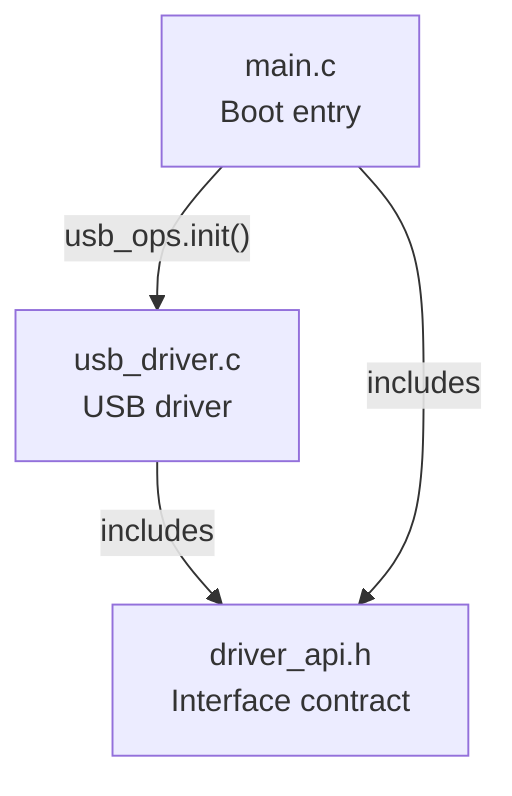

# Knowledge Map - Dummy Target

## Module Relationship

## Confirmed Conclusions

### 01-boot-init-flow (analysis/01-boot-init-flow.md)
- [C1] `main()` calls `usb_ops.init()` via function pointer dispatch, not direct call [main.c:13] → Referenced by: 02-usb-driver
- [C2] `usb_ops` is declared `extern` in main.c, defined in usb_driver.c:28 with `.init = usb_init_internal` → Referenced by: 02-usb-driver
- [C3] `legacy_init_do_not_use()` is dead code - declared in header, defined in driver, never called from any live path → Referenced by: none

## Open Questions
- [ ] What is the full register map? (need 02-usb-driver analysis)
- [ ] Why is `usb_ops.shutdown` set to NULL? Intentional or incomplete?

## Terminology
- **ops struct**: Function pointer table pattern for dynamic dispatch (common in Linux kernel drivers)
- **USB_CTRL_REG**: USB controller register, address computed via macro composition
